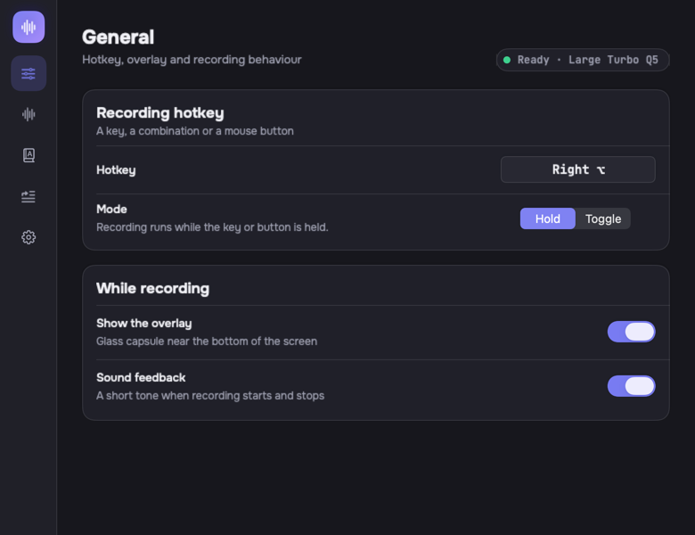

# SayVoice

SayVoice is a macOS menu-bar dictation app. Hold the hotkey (Right ⌥ by default), speak, release — the text is transcribed and inserted into whatever app you were typing in. Recognition runs entirely on this Mac with [whisper.cpp](https://github.com/ggerganov/whisper.cpp): nothing is uploaded, no account is needed, and it works with the network off. The app has no Dock icon; the menu bar carries the state, the recent dictations and the way into settings. It requires macOS 26.



## How it works

1. The global hotkey listener catches the key or mouse button (hold mode, or toggle mode for buttons that do not report being held).
2. Audio is captured from the microphone at 16 kHz mono; a glass overlay shows the level and the elapsed time.
3. Leading and trailing silence is trimmed, and recordings without speech are dropped before they reach the model.
4. whisper.cpp transcribes the samples locally, using the selected model, language and the dictionary of terms.
5. The app returns focus to the application the dictation started in and inserts the text there — through the Accessibility API or through the clipboard, whichever is selected.
6. The result is stored in the local history (the last 500 entries) and shown in the menu-bar popover.

## Requirements

- macOS 26.0 or newer
- Xcode 26
- [XcodeGen](https://github.com/yonaskolb/XcodeGen) — the Xcode project is generated, not committed

## Build

```sh
brew install xcodegen
xcodegen generate
```

Then open `SayVoice.xcodeproj`, or build from the command line:

```sh
xcodebuild -project SayVoice.xcodeproj -scheme SayVoice -configuration Release -derivedDataPath build build
```

Run `xcodegen generate` again after adding, moving or deleting files.

## Install

Copy the built app into `/Applications`:

```sh
cp -R build/Build/Products/Release/SayVoice.app /Applications/
```

On the first launch the onboarding asks for the two permissions the app cannot work without — Microphone and Accessibility (the hotkey listener and the Accessibility insertion need it) — then offers a model to download, lets you pick the hotkey and closes with a confirmation screen. Both permissions are granted in System Settings → Privacy & Security.

## Models

Models are downloaded on demand into `~/Library/Application Support/SayVoice/Models` and are never bundled with the app. Settings → Recognition and the first-run wizard both list all five, each with a line saying what it is for.

| Model | Size |
|---|---|
| Base | 148 MB |
| Small | 488 MB |
| Large Turbo Q5 (recommended) | 574 MB |
| Large Turbo Q8 | 874 MB |
| Large Turbo | 1.62 GB |

Larger models are more accurate and slower to load. Large Turbo Q5 is preselected on a fresh install.

## Settings

- **General** — the recording hotkey, hold or toggle mode, the overlay and sound feedback.
- **Recognition** — the model list with in-place downloads, and the recognition language (auto-detection or one of eleven languages).
- **Dictionary** — names and jargon the model should spell exactly as given.
- **Insertion** — clipboard or Accessibility insertion, and whether the clipboard is restored afterwards.
- **System** — open at login, version, source code and the third-party licences.

## Project layout

```
SayVoice/
  App/                    SayVoiceApp · AppCoordinator · AppState · AppStatus · AppWindow
  DesignSystem/
    Tokens/               Colors · Typography · Spacing · Motion
    Components/           Orb · GlassPanel · Card · SettingsRow · Chip · KeyCap · ModelRow
                          DownloadProgress · Waveform · TagField · EmptyState · Buttons
  Features/
    Settings/             SettingsView · SettingsRail · GeneralSection · RecognitionSection
                          DictionarySection · InsertionSection · SystemSection · LicensesSheet
                          HotkeyRecorder · ModelDownloads · SettingsRouter · SettingsSection
                          SectionHeader
    Overlay/              OverlayWindowController · OverlayModel · OverlayView
                          RecordingContent · TranscribingContent · ResultContent · ErrorContent
    Onboarding/           OnboardingView · OnboardingModel · ArtPanel · WelcomeStep
                          PermissionsStep · ModelStep · HotkeyStep
    History/              HistoryPopover · HistoryRow · HistoryFilter · RelativeTime
    MenuBar/              MenuBarController · StatusIcon
  Audio/                  AudioRecorder · AudioConverter · SilenceTrimmer
  Transcription/          TranscriptionEngine
  TextInjection/          TextInjector · AXTextInjector · PasteboardInjector
  HotkeyListener/         HotkeyListener · Hotkey
  Permissions/            PermissionManager
  ModelManagement/        ModelManager
  History/                TranscriptionHistoryStore · TranscriptionEntry
  Settings/               SettingsStore · SettingsKeys
  Resources/              Info.plist · Assets.xcassets · Fonts/ · Licenses/
Packages/CWhisper/        whisper.cpp wrapped as a Swift package
Tests/SayVoiceTests/      XCTest target: logic, layout and render tests
Scripts/render-surfaces   Regenerates docs/screenshots
```

`DesignSystem/` depends only on SwiftUI and AppKit — never on a feature type or a store.

## Tests

```sh
xcodebuild -project SayVoice.xcodeproj -scheme SayVoice -derivedDataPath build test
```

The suite needs no microphone; one download test touches the network for a fraction of a second. Logic tests, layout-fitting tests and off-screen render tests for every surface in both themes.

## Screenshots

`docs/screenshots/` holds every surface in both themes, rendered from the code itself:

```sh
Scripts/render-surfaces
```

The script generates the project if it is missing and runs the `SurfaceScreenshotTests` harness. Known limits: Liquid Glass renders as a flat fill off-screen, and prominent buttons render in their inactive state.

| | Dark | Light |
|---|---|---|
| Recording overlay | [overlay-recording-dark](docs/screenshots/overlay-recording-dark.png) | [overlay-recording-light](docs/screenshots/overlay-recording-light.png) |
| Onboarding — welcome | [onboarding-welcome-dark](docs/screenshots/onboarding-welcome-dark.png) | [onboarding-welcome-light](docs/screenshots/onboarding-welcome-light.png) |
| Onboarding — model | [onboarding-model-dark](docs/screenshots/onboarding-model-dark.png) | [onboarding-model-light](docs/screenshots/onboarding-model-light.png) |
| Onboarding — done | [onboarding-done-dark](docs/screenshots/onboarding-done-dark.png) | [onboarding-done-light](docs/screenshots/onboarding-done-light.png) |
| History popover | [history-filled-dark](docs/screenshots/history-filled-dark.png) | [history-filled-light](docs/screenshots/history-filled-light.png) |
| Settings — recognition | [settings-recognition-dark](docs/screenshots/settings-recognition-dark.png) | [settings-recognition-light](docs/screenshots/settings-recognition-light.png) |

## Licences

SayVoice is released under the MIT licence — see [LICENSE](LICENSE).

Third-party components, also listed in Settings → System → Licences:

- [whisper.cpp](https://github.com/ggerganov/whisper.cpp) — MIT
- [Onest](https://github.com/googlefonts/onest) — SIL Open Font License 1.1
- [JetBrains Mono](https://github.com/JetBrains/JetBrainsMono) — SIL Open Font License 1.1
